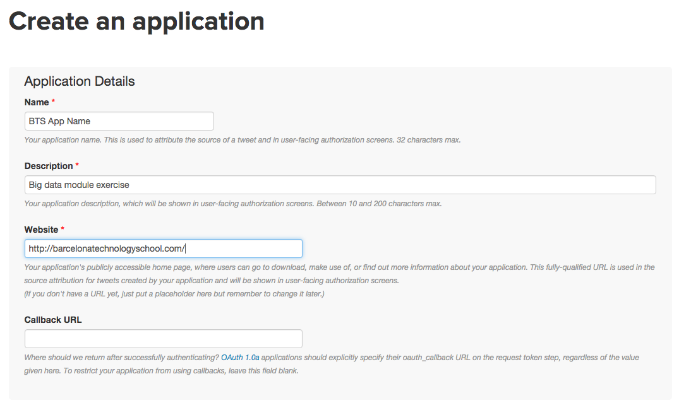
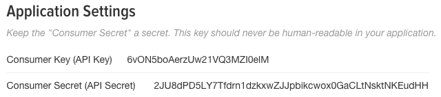
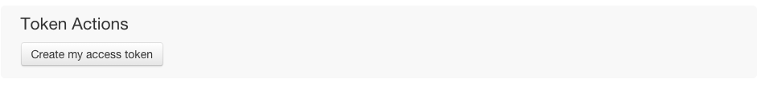
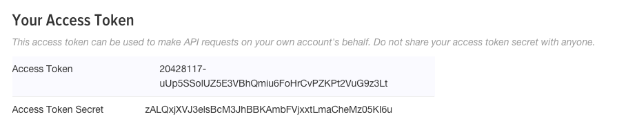
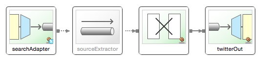

# Data Ingestion - Data Gathering

This is an exemple for the hands on Session #5 of the BigData module on BTS Master.
We will create together a project in Spring integration framework to collect data from twitter API.

### Set Up your development environment

 - Install Spring Tool Studio (STS): [https://spring.io/tools/sts/all](https://spring.io/tools/sts/all)
 - (only for windows) Install Java JDK 8: [http://www.oracle.com/technetwork/java/javase/downloads/jdk8-downloads-2133151.html](http://www.oracle.com/technetwork/java/javase/downloads/jdk8-downloads-2133151.html)
 

### Create an App for Twitter API access

Go to: [https://apps.twitter.com/](https://apps.twitter.com/)

Complete the form:

Go To Tokens Tab:

Get your Keys:

Active your Tokens:

Get your Tokens:

### Clone and develop the application

Clone this project in your terminal or Git Shell:

	$ git clone https://github.com/djkram/bts-demo-integration.git

Clone using STS:

	File > Import > Git > Projects from Git > Clone Uri
	
#### Set UP your Twitter Api Credentials

Open the properties file: 

	src/main/resources/application.properties

Set your credentials:

	twitter.oauth.consumerKey=
	twitter.oauth.consumerSecret=
	twitter.oauth.accessToken=20428117-
	twitter.oauth.accessTokenSecret=
	twitter.search.query=

Open the configuration file: 

	src/main/resources/twitter-integration-connection.xml

Contains this data ingestion flow:

Reference documentation of spring integration: [http://docs.spring.io/spring-integration/reference/htmlsingle/](http://docs.spring.io/spring-integration/reference/htmlsingle/)

- Read the [Part III](http://docs.spring.io/spring-integration/reference/htmlsingle/#spring-integration-introduction) for an overview.

- Read the [Part IV](http://docs.spring.io/spring-integration/reference/htmlsingle/#spring-integration-core-messaging) for a deep detail.

- Read the [Part V](http://docs.spring.io/spring-integration/reference/htmlsingle/#spring-integration-endpoints) to know the endpoints supported.

### HOMEWORK

- Modify this project to store the tweets on a file

- File endpoint Reference (outbound): [http://docs.spring.io/spring-integration/reference/htmlsingle/#file-writing](http://docs.spring.io/spring-integration/reference/htmlsingle/#file-writing)

- configuration file example: [https://github.com/spring-projects/spring-integration-samples/blob/master/basic/file/src/main/resources/META-INF/spring/integration/fileCopyDemo-file.xml](https://github.com/spring-projects/spring-integration-samples/blob/master/basic/file/src/main/resources/META-INF/spring/integration/fileCopyDemo-file.xml)

- **Create a Git repository in GitHub, push your project and send the link to your teacher.**

- How to push a Git to GItHub: [https://help.github.com/articles/adding-an-existing-project-to-github-using-the-command-line/](https://help.github.com/articles/adding-an-existing-project-to-github-using-the-command-line/)